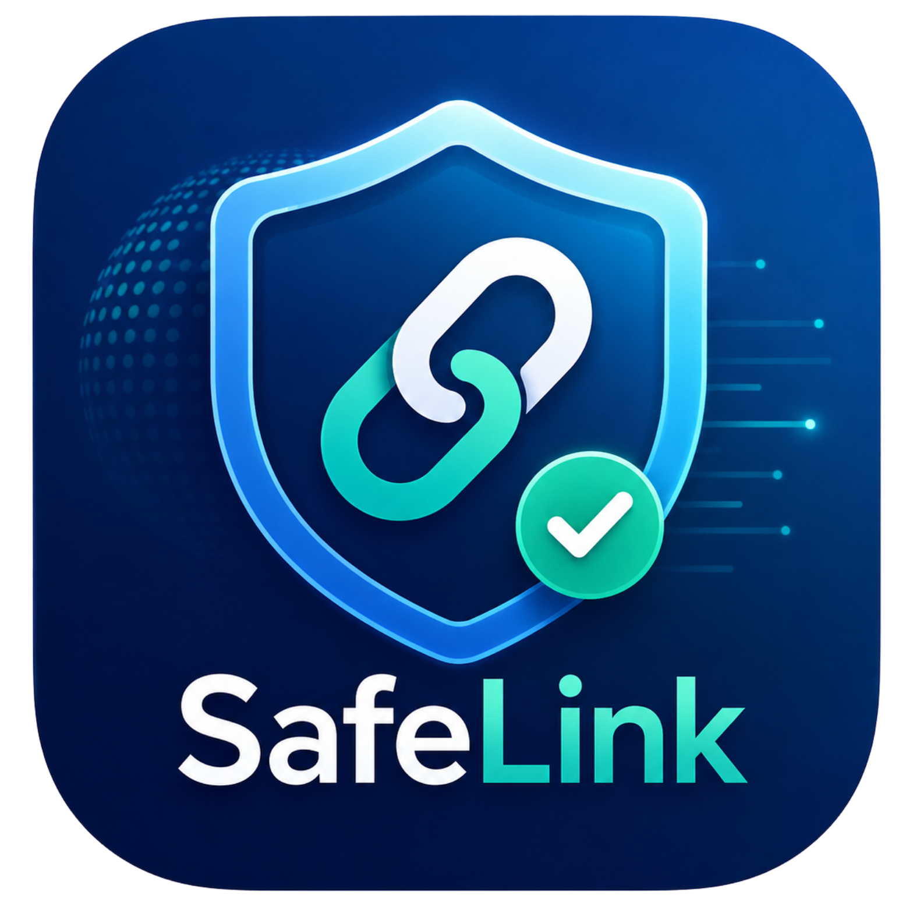
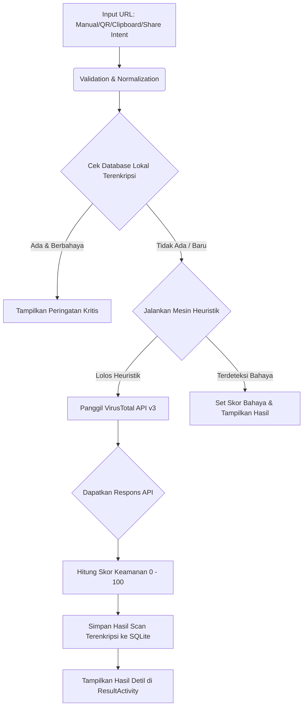

# 🛡️ SafeLink - Ultimate Android Link Safety Scanner

<p align="center">
  
</p>

<p align="center">
  <b>SafeLink</b> adalah aplikasi Android modern yang dirancang untuk melindungi pengguna dari ancaman phishing, malware, ransomware, dan situs web berbahaya secara real-time. Dibangun dengan fokus utama pada privasi data dan keindahan visual (Glassmorphism), SafeLink memberikan perlindungan berlapis sebelum Anda membuka tautan apa pun.
</p>

<p align="center">
  
  
  
  
  
  
</p>

---

## 🚀 Fitur Utama & Cara Kerja

### 🔍 Real-Time VirusTotal Scanner (v3 API)
SafeLink terintegrasi penuh dengan API VirusTotal v3. Setiap URL diubah menjadi hash Base64 yang valid (tanpa padding) dan diperiksa secara simultan terhadap lebih dari 70 engine keamanan global (seperti Kaspersky, Symantec, Google Safebrowsing, dll.).

### 📋 Smart Clipboard Monitor
Aplikasi secara aktif memantau clipboard perangkat secara non-intrusif. 
* Saat mendeteksi URL baru, sebuah **Snackbar** adaptif akan muncul menawarkan pemindaian sekali klik.
* Jika URL tersebut sudah diketahui berbahaya di database lokal, aplikasi langsung menampilkan **dialog peringatan kritis** berwarna merah untuk mencegah pembukaan tidak sengaja.

### 📤 Android Share Intent Integration
Mendukung interaksi antar-aplikasi secara dinamis. Anda dapat langsung membagikan link dari Google Chrome, WhatsApp, Telegram, atau aplikasi lainnya ke SafeLink. Aplikasi akan langsung mengekstrak URL dari teks dan membuka pemindaian secara otomatis.

### 📸 QR Code Intelligent Scanner
Menggunakan pustaka **ZXing (Zebra Crossing)** untuk memindai kode QR secara instan menggunakan kamera handphone. Hasil scan langsung divalidasi keamanannya tanpa Anda perlu mengetik URL secara manual.

### 🔐 Database Terenkripsi Tingkat Militer (SQLCipher)
Semua riwayat pemindaian dan situs yang disimpan di bookmark diamankan menggunakan enkripsi **AES-256** melalui **SQLCipher**. Data tidak dapat diakses atau didekripsi oleh aplikasi lain di perangkat yang sama, menjamin kerahasiaan riwayat penelusuran Anda.
* **Offline Cache (Migrasi v5)**: Menyimpan seluruh objek data respons JSON asli dari VirusTotal (`api_response_json`) pada tabel `history` dan `bookmarks`. Hal ini memungkinkan pengguna melihat detail pemindaian secara penuh dan interaktif meskipun sedang offline, tanpa membuang kuota panggilan API tambahan.

### 🌐 Safe Browser Internal
Jika link dinyatakan aman atau pengguna bersikeras membukanya, SafeLink menyediakan Webview internal cerdas yang dilengkapi dengan pendeteksi heuristik untuk memblokir navigasi berbahaya secara instan jika mendeteksi anomali di tengah jalan.

---

## 📊 Alur Kerja Aplikasi (Workflow)

Berikut adalah diagram bagaimana SafeLink menganalisis dan mengamankan setiap tautan yang masuk:


---

## 🛠️ Arsitektur & Teknologi

SafeLink menggunakan arsitektur modern berorientasi performa tinggi untuk mencegah *Application Not Responding (ANR)*:

* **Retrofit 2 & OkHttp3**: Networking asynchronous yang hemat memori, dilengkapi dengan *Interceptor* global untuk injeksi *x-apikey* secara aman.
* **Double-Checked Locking Singleton**: Inisialisasi API client yang thread-safe untuk menghemat siklus CPU.
* **ExecutorService Thread Pool**: Menghindari pemrosesan database dan API pada main thread.
* **Lottie Animations**: Animasi pemindaian menggunakan file JSON vektor berukuran sangat ringan namun memberikan pengalaman visual berkualitas tinggi.
* **ThemeHelper & Dynamic Colors**: Dukungan tema Gelap/Terang adaptif serta integrasi warna dinamis Material 3 (menyesuaikan warna wallpaper perangkat pada Android 12+).

---

## 🗄️ Skema Database Terenkripsi (SQLCipher)

Database SafeLink diamankan sepenuhnya menggunakan library **SQLCipher** dengan algoritma enkripsi **AES-256**. Keamanan riwayat pemindaian dan bookmark dijamin tidak dapat dibaca oleh aplikasi luar tanpa otentikasi kunci yang valid.

### Riwayat Migrasi Database (`DatabaseHelper.java`)
Seiring pengembangan, database mengalami pembaruan terstruktur melalui siklus hidup versi:
* **Database Version 1 (v1)**: Pembuatan tabel `history` utama.
* **Database Version 2 (v2)**: Penambahan tabel `bookmarks` untuk menyimpan tautan favorit pengguna.
* **Database Version 3 (v3)**: Penambahan tabel `trusted_domains` untuk menangani *domain daftar putih*.
* **Database Version 4 (v4)**: Penambahan tabel `blacklist_domains` untuk memblokir cepat *domain daftar hitam*.
* **Database Version 5 (v5)**: Penambahan kolom `api_response_json` pada tabel `history` dan `bookmarks` untuk penyimpanan offline respon analitik VirusTotal secara penuh.

### Deskripsi Tabel & Kolom Utama

#### 1. Tabel `history` (Riwayat Scan)
Menyimpan riwayat pemindaian URL pengguna.
| Nama Kolom | Tipe Data | Deskripsi |
|---|---|---|
| `id` | `INTEGER PRIMARY KEY` | ID unik auto-increment |
| `url` | `TEXT NOT NULL` | Tautan URL penuh yang dipindai |
| `status` | `TEXT NOT NULL` | Status akhir pemindaian (misal: "Safe", "Malicious") |
| `risk_level` | `TEXT` | Tingkat risiko (misal: "LOW", "HIGH") |
| `recommendation` | `TEXT` | Rekomendasi tindakan pengguna |
| `scanned_at` | `TEXT NOT NULL` | Cap waktu tanggal & waktu pemindaian |
| `api_response_json` | `TEXT` | Cache respons mentah JSON dari API VirusTotal (Offline Mode) |

#### 2. Tabel `bookmarks` (Bookmark URL)
Menyimpan tautan yang ditandai atau difavoritkan pengguna.
| Nama Kolom | Tipe Data | Deskripsi |
|---|---|---|
| `id` | `INTEGER PRIMARY KEY` | ID unik auto-increment |
| `url` | `TEXT NOT NULL` | Tautan URL |
| `title` | `TEXT` | Judul kustom bookmark |
| `category` | `TEXT` | Kategori bookmark (misal: "Work", "Sosmed") |
| `notes` | `TEXT` | Catatan tambahan pengguna |
| `favicon` | `TEXT` | URL/Path dari ikon website (jika ada) |
| `status` | `TEXT` | Status terakhir link |
| `scanned_at` | `TEXT` | Tanggal pemindaian terakhir |
| `api_response_json` | `TEXT` | Cache respons mentah JSON dari API VirusTotal (Offline Mode) |

#### 3. Tabel `trusted_domains` & `blacklist_domains`
Menyimpan pengecualian pemindaian lokal pengguna.
* **Kolom**: `id` (`INTEGER PRIMARY KEY`), `domain` (`TEXT NOT NULL UNIQUE`), `added_at` (`TEXT NOT NULL`).

---

## 💻 Contoh Kode Implementasi Kunci

### 1. Inisialisasi Database Terenkripsi (SQLCipher)
```java
// Memastikan library SQLCipher dimuat sebelum database diakses
try {
    net.sqlcipher.database.SQLiteDatabase.loadLibs(context);
} catch (Throwable t) {
    Log.e("Database", "Gagal memuat library SQLCipher", t);
}

// Membuka database dengan kunci enkripsi rahasia
SQLiteDatabase db = this.getWritableDatabase("KUNCI_RAHASIA_AES256");
```

### 2. Validasi Heuristik Mandiri (`UrlHeuristicEngine.java`)
Membatasi panggilan API yang mahal dengan melakukan deteksi cepat secara lokal terhadap pola penipuan:
```java
public static int calculateHeuristicScore(String url) {
    int penalty = 0;
    if (url.startsWith("http://")) {
        penalty += 20; // Penalti karena tidak menggunakan HTTPS
    }
    if (isShortener(url)) {
        penalty += 15; // Penalti karena menggunakan shortener URL (potensi kamuflase)
    }
    if (containsSuspiciousKeywords(url)) {
        penalty += 30; // Penalti kata kunci phishing (seperti: 'free-gift', 'login-update')
    }
    return Math.min(penalty, 100);
}
```

---

## 📂 Struktur Repositori

```text
SafeLink/
│
├── app/
│   ├── build.gradle            # Konfigurasi dependensi & build buildConfigField
│   └── src/
│       ├── main/
│       │   ├── AndroidManifest.xml
│       │   ├── java/com/example/safelink/
│       │   │   ├── activities/      # Splash, Main, Result, SafeBrowser
│       │   │   ├── adapters/        # HistoryAdapter, EngineResultAdapter
│       │   │   ├── database/        # HistoryRepository, DatabaseHelper
│       │   │   ├── fragments/       # HomeFragment, HistoryFragment, BookmarkFragment
│       │   │   ├── models/          # ApiResponse, ScanResult, HistoryModel
│       │   │   ├── network/         # ApiClient, ApiService, RetrofitInstance
│       │   │   └── utils/           # NetworkHelper, UrlHeuristicEngine, ThemeHelper
│       │   └── res/
│       │       ├── layout/          # Layout XML (Premium Glassmorphism design)
│       │       └── values/          # Colors, Strings (M3 Color Tokens)
│       └── test/                    # JUnit local unit tests
```

---

## 🚀 Panduan Instalasi & Persiapan

### 1. Prasyarat System
* **Android Studio Ladybug (2024.2.1)** atau lebih baru.
* **JDK 21** terpasang dan dikonfigurasi sebagai JDK Gradle di Android Studio.
* Smartphone fisik Android atau Emulator dengan **Android 9.0 (API 28)** atau lebih baru.

### 2. Kunci API VirusTotal
Agar pemindaian online berfungsi, Anda perlu mendaftarkan kunci API gratis Anda sendiri:
1. Daftar akun gratis di [VirusTotal](https://www.virustotal.com/).
2. Masuk ke menu profil Anda dan salin **API Key** yang disediakan.
3. Di komputer Anda, buka file `local.properties` pada direktori root SafeLink:
   ```properties
   # local.properties
   sdk.dir=C\:\\Users\\NamaUser\\AppData\\Local\\Android\\Sdk
   VIRUSTOTAL_API_KEY=MASUKKAN_API_KEY_VIRUSTOTAL_ANDA_DISINI
   ```
*(Catatan: `local.properties` terdaftar di `.gitignore` secara default sehingga kunci API Anda tidak akan pernah bocor ke publik saat di-push ke GitHub).*

### 3. Kompilasi & Jalankan Aplikasi
Gunakan terminal untuk melakukan kompilasi proyek:
```powershell
# Jalankan kompilasi debug apk (Output: app/build/outputs/apk/debug/SafeLink-debug.apk)
./gradlew assembleDebug

# Jalankan kompilasi release apk (Output: app/build/outputs/apk/release/SafeLink-release.apk)
./gradlew assembleRelease
```
Atau klik tombol **Run** langsung di Android Studio. Hasil file APK secara otomatis diberi nama **SafeLink-debug.apk** atau **SafeLink-release.apk** sesuai dengan tipe kompilasi yang dipilih.

---

## 🧪 Pengujian Kode (Unit Testing)

Kami telah menyediakan suite pengujian lokal untuk menguji keakuratan deteksi heuristik dan formatting Base64:
```powershell
# Jalankan unit tests
./gradlew testDebugUnitTest
```

---

<p align="center">
  Dibuat dengan penuh ❤️ oleh <b>ShinZeleo</b> untuk Keamanan Digital yang Lebih Baik.
</p>
